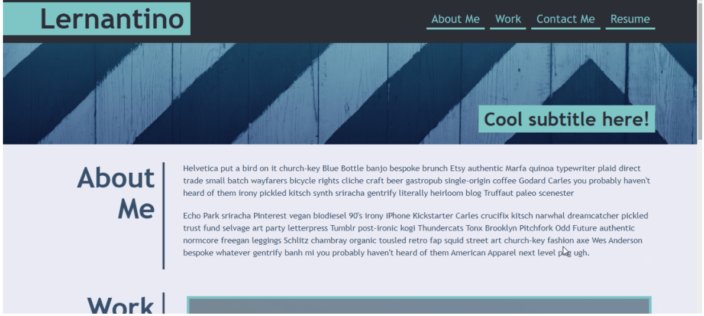
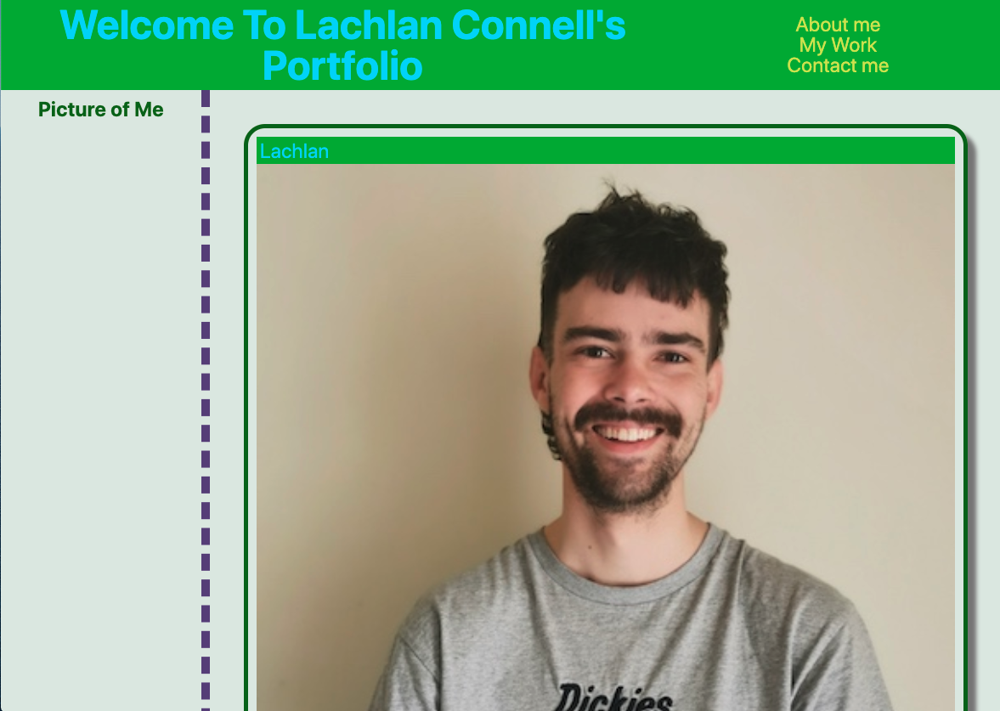
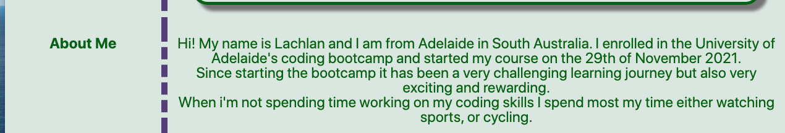
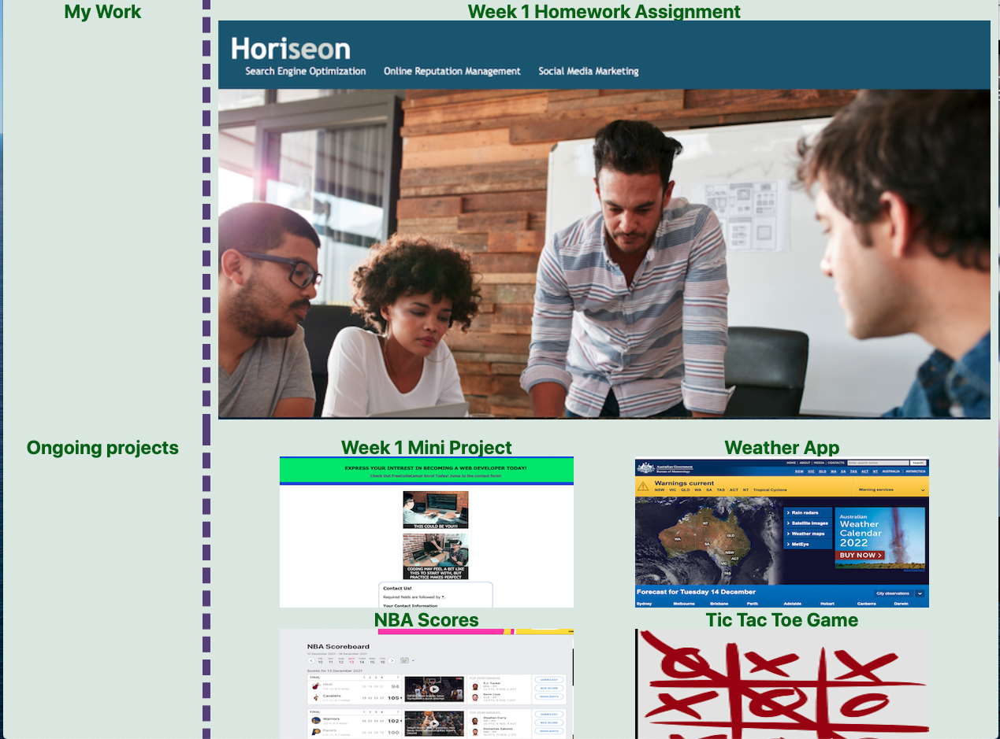
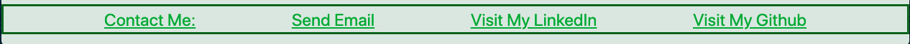
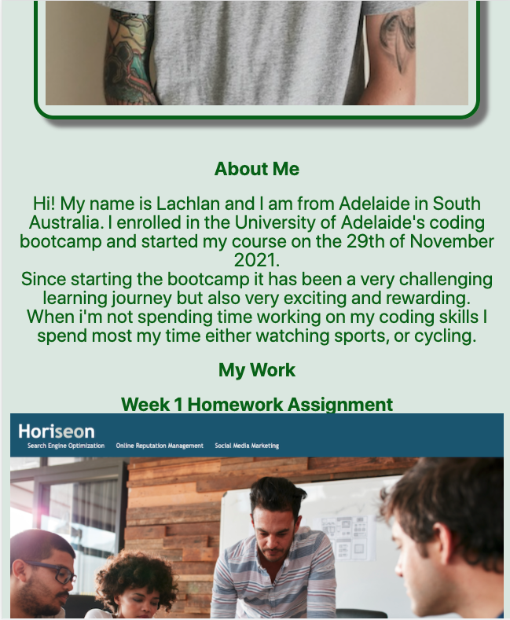
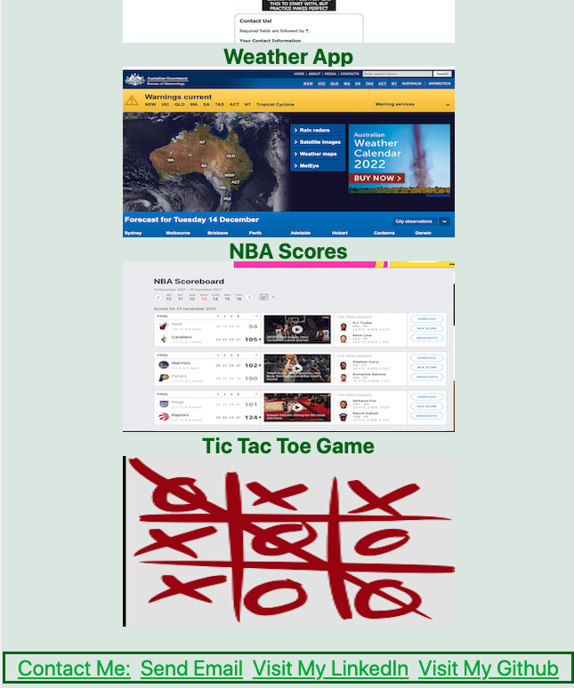

# 02 Advanced CSS: Portfolio

## The Project

For this project we had to create a portfolio from scratch to put our work into. As we haven't completed many projects yet, I was only able to include 2 of my own work and used other various webpages, which at a later date in the course will be updated to show my own work. The porfolio was to include the following things: My name, a photo of me, links to sections about me & my work & contact me, a my work section where the first image is larger in size than the others, when you click an image application you should be taken to the deployed webpage and last of all when you resize the webpage the layout needs to be resposive.

## Mock Up

The following images show some of the images of the mockup we were shown

## Finished Product

The following image shows the web application's appearance 

> **Note**: This shows the landing page including the header image and navigation bar and photo of me.

> **Note**: This shows the about me section.

> **Note**: This shows the my work section.

> **Note**: This shows my footer section.

> **Note**: This shows the appearance of the wabpage on a smaller device such as a tablet. As you can see the side bar is gone and the smaller images of work have arranged on top of eachother on top of the larger image

## A link to the webpage is shown below:
https://lconnell1000.github.io/Portfolio_GIT/
