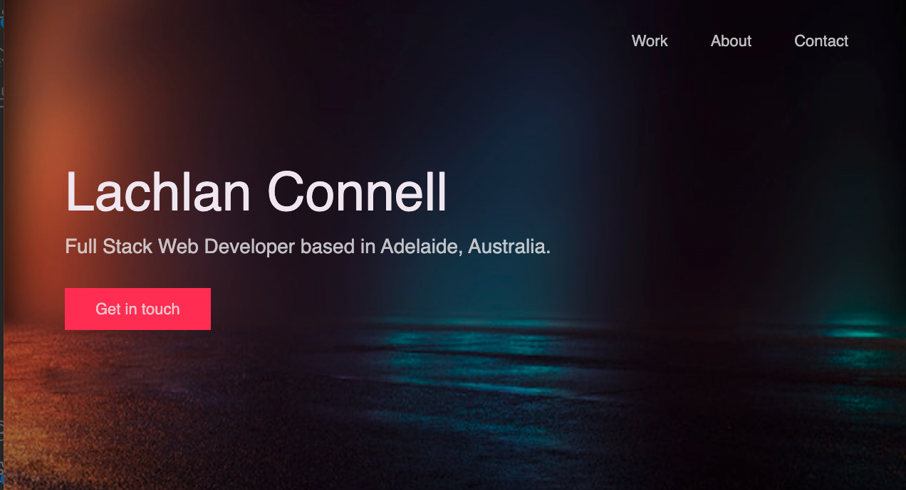
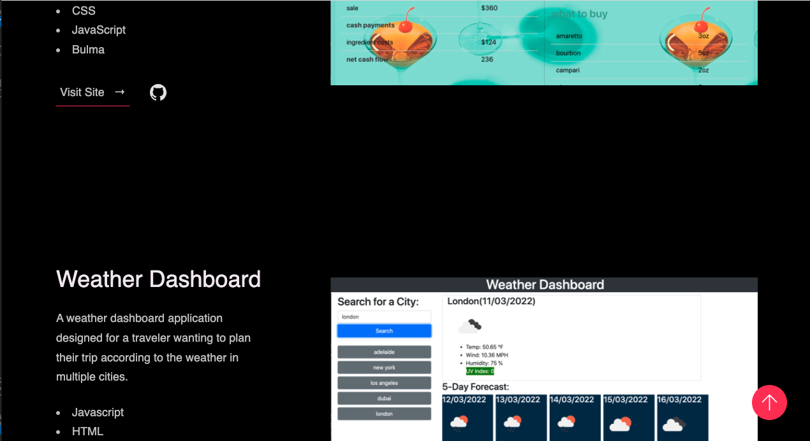
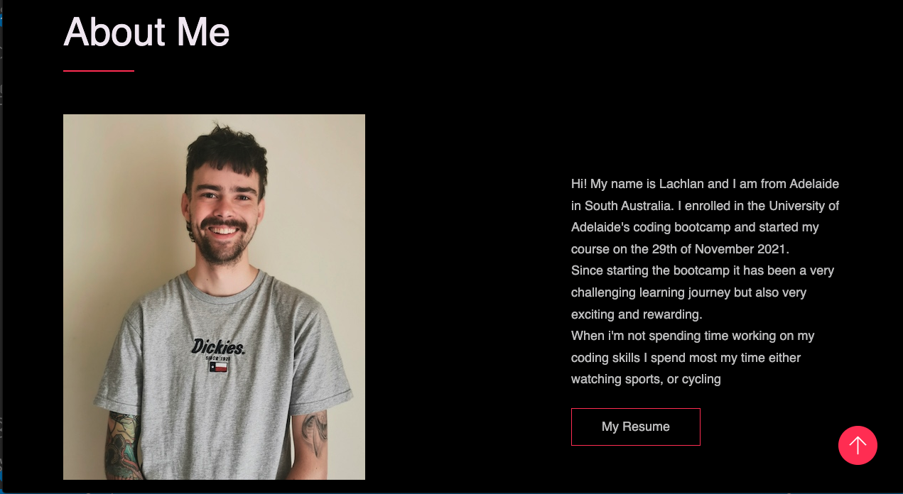
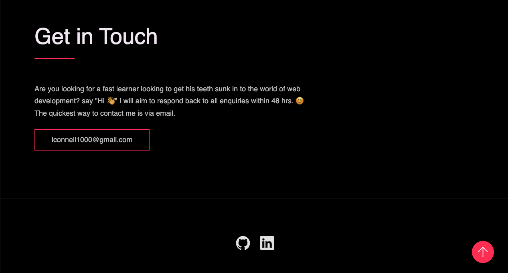

# 02 Advanced CSS: Portfolio

## The Project

For this project we had to create a portfolio from scratch to put our work into. As we haven't completed many projects yet, I was only able to include 2 of my own work and used other various webpages, which at a later date in the course will be updated to show my own work *update 11/3/22, now shows exclusively my own work. The porfolio was to include the following things: My name, a photo of me, links to sections about me & my work & contact me and a my work section, with links to deployed application's if applicable, or a video walk through of non deployed applications.

## Finished Product

The following image shows the web application's appearance 

> **Note**: This shows the landing page .

> **Note**: This shows the my work section.

> **Note**: This shows the about me section.

> **Note**: This shows the contact me section with links to my github and linkedIn.

## A link to the webpage is shown below:
https://lconnell1000.github.io/Portfolio_GIT/
